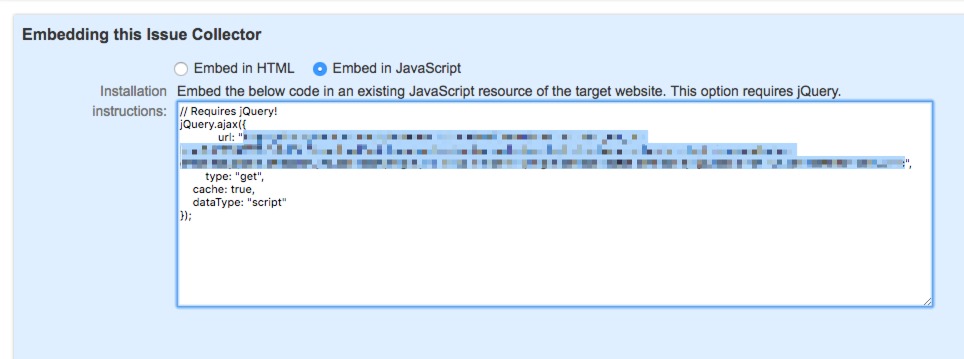

# Magento 2 - JIRA Issue Collector Module

This very simple Magento 2 Module will render a [JIRA Issue Collector](https://confluence.atlassian.com/adminjiraserver071/using-the-issue-collector-802592637.html) for your Magento 2 instance.

Once you set the correct URL pointing to your JIRA Instance Issue Collector endpoint, you'll be able
to set weather you want the issue collector on the store front, the admin area or both.

## Installation

- `composer require cyber-duck/magento2-jira-issue-collector`
- `bin/magento module:enable CyberDuck_JiraIssueCollector`
- `bin/magento setup:upgrade`

## Configuration

Options for the module are defined in the admin area under `Stores > Configuration > General > Web > 
JIRA Issue Collector`.

You'll need your embed JavaScript URL endpoint from your JIRA instance:



We will use the standard approach from Magento 2 using `require.js` in order to consume the endpoint
specified in the configuration and render the issue collector.

## Compatibility

The module has been developed and tested on Magento 2.2.x.

## Contribute

PRs are more than welcome!

## License

```
MIT License

Copyright (c) 2018 Cyber-Duck

Permission is hereby granted, free of charge, to any person obtaining a copy
of this software and associated documentation files (the "Software"), to deal
in the Software without restriction, including without limitation the rights
to use, copy, modify, merge, publish, distribute, sublicense, and/or sell
copies of the Software, and to permit persons to whom the Software is
furnished to do so, subject to the following conditions:

The above copyright notice and this permission notice shall be included in all
copies or substantial portions of the Software.

THE SOFTWARE IS PROVIDED "AS IS", WITHOUT WARRANTY OF ANY KIND, EXPRESS OR
IMPLIED, INCLUDING BUT NOT LIMITED TO THE WARRANTIES OF MERCHANTABILITY,
FITNESS FOR A PARTICULAR PURPOSE AND NONINFRINGEMENT. IN NO EVENT SHALL THE
AUTHORS OR COPYRIGHT HOLDERS BE LIABLE FOR ANY CLAIM, DAMAGES OR OTHER
LIABILITY, WHETHER IN AN ACTION OF CONTRACT, TORT OR OTHERWISE, ARISING FROM,
OUT OF OR IN CONNECTION WITH THE SOFTWARE OR THE USE OR OTHER DEALINGS IN THE
SOFTWARE.
```

----

Made with :heart: by [Cyber-Duck Ltd](https://www.cyber-duck.co.uk)
